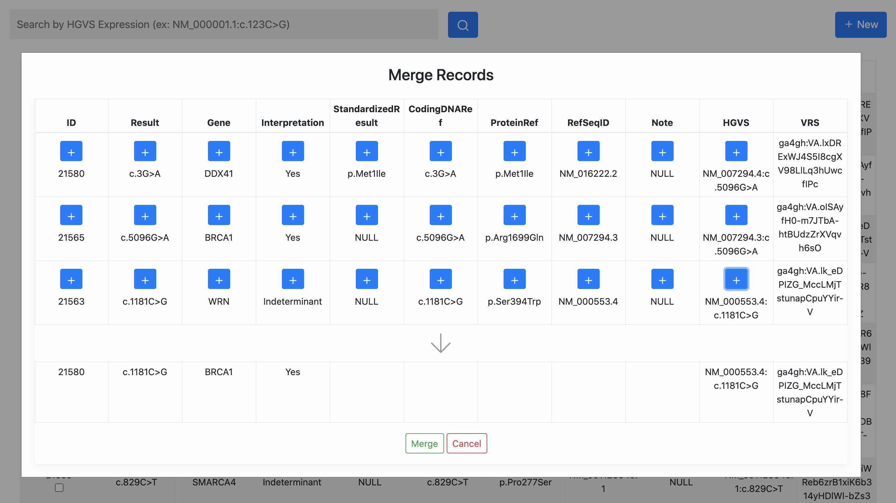
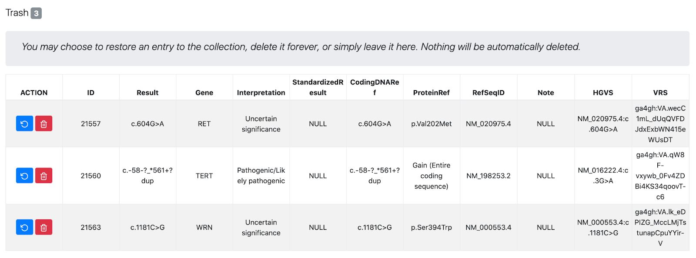

# LocalVar

### Setup

This is a Flask web application and requires Python 3.X to be installed. A list of required environment dependencies can be found in <i>requirements.txt</i>. A Dockerfile has been included to ease the setup process. However, in order to generate VRS identifiers, the [seqrepo-rest-service](https://github.com/biocommons/seqrepo-rest-service) should be running on port 5000.

The app can be launched using <code>python3 app.py</code>

### Overview

The tool is initialized when a new collection is added in the form of a .csv file. This file is uploaded by the user in the "New Collection" screen. The file must contain unique identifiers in the first column, a column containing full HGVS expressions, and an "interpretation" column.

 

The user will be prompted to select the names of the column containing the HGVS expressions and the column containing the variant interpretation.

 

VRS identifiers will be added as an additional column as part of the initialization process. The resulting collection is displayed in the "View Collection" screen as an interactive table. The search bar is linked to the column containing HGVS expressions and will auto-complete based on the expressions in the collection.

 

If one or more records (rows) are selected via the checkboxes, a "Trash" button will appear and allow the user to send multiple records to the trash. If two or more records are selected, a "Merge" button will appear and allow the user to merge records into a single record.

 

The new-entry field is expanded when the "New" button is clicked. New records must be added as a comma-separated line with no ID and no VRS values (these will be added automatically). Multiple new entries should be on separate lines.

 

Records (rows in the table) can be clicked to enter a detailed view of the record. This view shows if the HGVS expression is also detected within ClinVar. If so, it will display the clinical significance as determined by ClinVar as well as any synonymous HGVS expressions. Within this detailed view, fields of the record can be directly edited. Any editing of the HGVS expression will result in a new VRS identifier and updated information from ClinVar. All edits to records (both manual and asynchronous from accepted update suggestions) are stored in an edit history for that record which is also displayed in this detailed view. Users can move a record to the trash by clicking the red "X" in the top-right corner of the page.

 

Records moved to the trash can be recovered or permanently deleted. Recovered records will contain timestamped events of both moving to the trash and being restored from the trash.

 

The "Suggestions" page allows users to review three types of auto-generated suggestions. The first type are suggestions to update the interpretation of the record to match what is in ClinVar. If accepted, LocalVar can either change all instances of the interpretation conflict, or just that of the record corresponding with the suggestion. This update, if accepted, is timestamped and recorded in the history of the record.

 

The second type consist of records that have identical HGVS expressions. The user can merge two or more records with identical HGVS expressions into a single record. This new record will contain a timestamped record of the event. The old records will be moved to the trash.

 

The third type of suggestions are those for two HGVS expressions that ClinVar has stored as synonyms of one another. The user can merge these two records into one. The event is timestamped and recorded in the history of the merged record and the old record(s) is/are moved to the trash.

 

There are three "Report" pages accessible via the fixed sidebar. The first allows the user to capture and download the current state of the collection as a .csv file. This allows users the opportunity to be independent of LocalVar without losing valuable information about the collection.

 

The second allows the user to capture and download the current history of the collection. This is a .json file and contains the individual edit histories of all records in the collection. This also allows a user to move to other tooling without losing the valuable information collected by LocalVar.

 

The third allows users to explore the ClinVar data utilized by LocaVar. It is a .json file of the bins of HGVS synonyms and clinical significance annotations gathered asynchronously by LocalVar.

 
